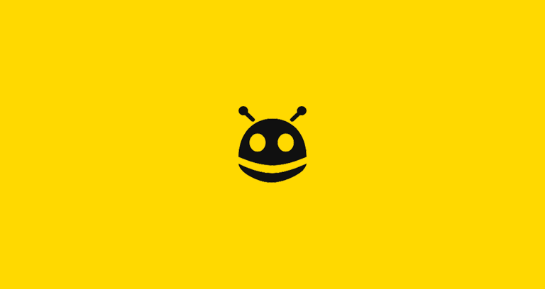

# Stoqey

<div align="center">

  [](https://stoqey.com)

  ### Simple, AI Currency.

</div>

This is the main monorepo codebase of [Stoqey](https://stoqey.com). Every single line of code.

## What is Stoqey?

### Vision

It is difficult to trade, maintain and measure the impact of investments. Investors/traders need modern, ai-based bots running into scaling issues when investments grows beyond a few hundred dollars, It becomes hard to keep track of portfolios, know what news are happening, and ensure that the investments are staying healthy and profitable.

**Stoqey aims to be the best platform to build any kind of ai-bot by combining the best of strategies and real-time market data feeds.** With best-in-class moderation tooling, a single platform for all your investments, ai-powered by default, automatic portfolio management, and much more to come we think that we will be able to help more people start and grow the best portfolios without worrying about maintaining them.


<div align="center">
  
</div>

## Docs

- [Stoqey](#stoqey)
    - [Simple, AI Currency.](#simple-ai-currency)
  - [What is Stoqey?](#what-is-stoqey)
    - [Vision](#vision)
  - [Docs](#docs)
  - [Contributing](#contributing)
    - [Ground Rules](#ground-rules)
      - [Reporting a bug or discussing a feature idea](#reporting-a-bug-or-discussing-a-feature-idea)
      - [Fixing a bug or implementing a new feature](#fixing-a-bug-or-implementing-a-new-feature)
    - [Codebase](#codebase)
      - [Technologies](#technologies)
      - [Folder structure](#folder-structure)
      - [Code Style](#code-style)
        - [Rules](#rules)
    - [First time setup](#first-time-setup)
      - [Installation](#installation)
      - [Migrating the database](#migrating-the-database)
      - [Getting the secrets](#getting-the-secrets)
    - [Running the app locally](#running-the-app-locally)
      - [Background services](#background-services)
      - [Start the servers/backend](#start-the-serversbackend)
      - [Develop the Mobile UI](#develop-the-mobile-ui)
  - [License](#license)

## Contributing

**We heartily welcome any and all contributions that match our engineering standards!**

That being said, this codebase isn't your typical open source project because it's not a library or package with a limited scope—it's our entire product.

### Ground Rules


#### Reporting a bug or discussing a feature idea

If you found a technical bug on Stoqey or have ideas for features we should implement, the issue tracker is the best place to share your ideas. Make sure to follow the issue template and you should be golden! ([click here to open a new issue](https://github.com/stoqey/stoqey/issues/new))

#### Fixing a bug or implementing a new feature

If you find a bug on Stoqey and open a PR that fixes it we'll review it as soon as possible to ensure it matches our engineering standards.

If you want to implement a new feature, open an issue first to discuss what it'd look like and to ensure it fits in our roadmap and plans for the app (see [the main project board](https://github.com/stoqey/stoqey/projects/23) for planned and currently ongoing work).

If you want to contribute but are unsure to start, we have [a "good first issue" label](https://github.com/stoqey/stoqey/issues?q=is%3Aissue+is%3Aopen+label%3A%22good+first+issue%22) which is applied to newcomer-friendly issues. Take a look at [the full list of good first issues](https://github.com/stoqey/stoqey/issues?q=is%3Aissue+is%3Aopen+label%3A%22good+first+issue%22) and pick something you like!  

Want to fix a bug or implement an agreed-upon feature? Great, jump to the [local setup instructions](#first-time-setup)!

<div align="center">
  
</div>

### Codebase

#### Technologies

With the ground rules out of the way, let's talk about the coarse architecture of this mono repo:

- **Full-stack TypeScript**: We use Node.js to power our servers, and React to power our frontend apps. Almost all of the code you'll touch in this codebase will be TypeScript.

Here is a list of all the big technologies we use:

- **Couchbase**: Data storage
- **Redis**: Background jobs and caching
- **GraphQL**: API, powered by the entire Apollo toolchain
- **TypeScript**: Best Type-safe JavaScript
- **React**: Frontend React app
- **ReactNative**: Mobile Frontend React native app

#### Folder structure

```sh
Stoqey/
├── admin      # Admin-UI frontend
├── mobile     # React-native mobile app
├── backend    # Backend server
├── docs
├── shared     # Shared code
```

#### Code Style

We run Prettier on-commit, which means you can write code in whatever style you want and it will be automatically formatted according to the common style when you run `git commit`. We also have ESLint set up, although we've disabled all stylistic rules since Prettier takes care of those.

##### Rules

- **No `console.log`s in any file**: We use the `debug` module across the codebase to log debugging information in development only. Never commit a file that contains a `console.log` as CI will fail your build. The only exceptions are errors, which you can log, but you have to use `console.error` to be explicit about it

<div align="center">
  
</div>

### First time setup

The first step to running Stoqey locally is downloading the code by cloning the repository:

```sh
git clone git@github.com:stoqey/stoqey.git
```
 If you get `Permission denied` error using `ssh` refer [here](https://help.github.com/articles/error-permission-denied-publickey/)
or use `https` link as a fallback.
```sh
git clone https://github.com/stoqey/stoqey.git
```

#### Installation

Stoqey has three big installation steps:

1. **Install Couchbase**: See [the Couchbase documentation](https://docs.couchbase.com/server/current/install/install-intro.html) for instructions on installing it with your OS.
2. **Install Redis**: See [the Redis documentation](https://redis.io/download) for instructions on installing it with your OS.
3. **Install the dependencies**: You need NVM v7.X.X because we are using npm workspaces

  ```sh
npm install  --legacy-peer-deps
  ```

You've now finished installing everything! Let's migrate the database and you'll be ready to go :100:

#### Migrating the database

When you first download the code and want to run it locally you have to migrate the database and seed it with test data:

In the terminal, run these commands:

```sh
npm run db:migrate
npm run db:seed
# ⚠️ To empty the database (e.g. if there's faulty data) run npm run db:drop
```

There's a shortcut for dropping, migrating and seeding the database too:
```sh
npm run db:reset
```

The `testing` database used in end to end tests is managed separately. It is built, migrated, and seeded when you run:

```sh
npm run be
```

To drop the `testing` database, go to http://localhost:8091/ui/index.html# while `couchbase` is running, and click Delete bucket from the ui.

#### Getting the secrets

While the app will run without any secrets set up, you won't be able to sign in locally. To get that set up, copy the provided example secrets file to the real location:

```
cp env.example .env
```

> Note: If you're an engineer at Stoqey we've got a more complete list of secrets that also lets you upload images etc. in LastPass, search for "secrets" to find it.

Now you're ready to run the app locally and sign into your local instance!

### Running the app locally

#### Background services

Whenever you want to run Stoqey locally you have to have Couchbase and Redis running in the background.  

#### Start the servers/backend

No matter what you're trying to do though, you'll want to have the API running from the backend, so start that in a background tab:

```
npm run be
```

#### Develop the Mobile UI

To develop the mobile UI run any

```
npm run ios
npm run android
```

> Note: If something didn't work or you ran into troubles please submit PRs to improve this doc and keep it up to date!	

<br />	
<div align="center">	
  	
</div>	

## License	
BSD 3-Clause, see the [LICENSE](./LICENSE) file.